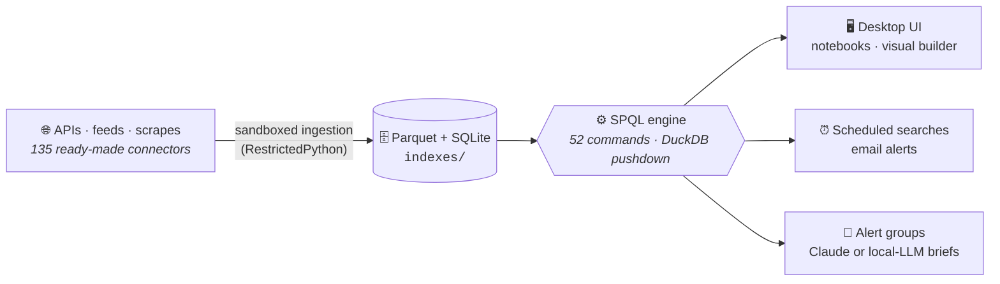

<div align="center">

<picture>
  <source media="(prefers-color-scheme: dark)" srcset="logos/speakesQuery_logo_svgs_REV6/speakesquery_dark.svg">
  
</picture>

<h3>Pipe-powered search over everything you ingest - on hardware you own.</h3>

<p><strong>Local-first · zero telemetry · zero cloud dependency · AI when <em>you</em> want it, budget-gated when you do</strong></p>

<p>
  
  
  
  
</p>
<p>
  
  
  
  
</p>

<p>
  <a href="#-quick-start"><strong>Quick Start</strong></a> &nbsp;&bull;&nbsp;
  <a href="#-features">Features</a> &nbsp;&bull;&nbsp;
  <a href="#-docker">Docker</a> &nbsp;&bull;&nbsp;
  <a href="docs/lang/01_fundamentals.md">Query Syntax</a> &nbsp;&bull;&nbsp;
  <a href="docs/lang/06_application_guide.md">Application Guide</a> &nbsp;&bull;&nbsp;
  <a href="docs/lang/07_email_setup.md">Email Setup</a>
</p>

</div>

---

One query language - **SPQL** - over local Parquet and SQLite. Ingest anything on a schedule, search it with pipes, rank it semantically, hand it to an LLM mid-pipeline, and get analyst briefs in your inbox. Everything runs on your machine: no accounts, no telemetry, no cloud dependency. (The optional AI features call the Anthropic API *or* a model on your own GPU - your choice.)

```text
index="indexes/polymarket/active_markets/*" earliest=-7d
| nearest "surprise fed rate decision" topk=20
| llm model="claude-haiku-4-5-20251001"
      prompt="One line: why could this move markets this week?"
      max_cost_usd=0.10
| table question, yes_price, volume, _llm_output
```

*One pipeline: pull a week of prediction-market data, rank it by meaning (local embeddings, no API), ask an LLM to explain the top hits - with a hard 10-cent ceiling - and lay it out as a table.*

| 🔒 **Yours, full stop** | 🤖 **AI on your terms** | 📦 **Batteries included** |
|---|---|---|
| Your data never leaves your machine. No accounts, no telemetry, no rent-seeking - the core engine is free by design, permanently. | Claude API **or** your own LM Studio / llama.cpp / Ollama box at $0/token. Every billable pipe takes `max_cost_usd=` and `dry_run=true`. | 135 tested one-click connectors (101 need no API key), 52 SPQL commands, notebooks, a visual query builder, and email briefs - out of the box. |

> **Project ethos** - SpeakesQuery is intentionally designed as non-rent-seeking software. It exists to be transparent, inspectable, and useful on its own merits. It survives only through correctness, clarity, and trust - not artificial restrictions or gated capability.

## ⚡ Quick Start

**Prerequisite:** [Docker](https://www.docker.com/products/docker-desktop/) installed and running. That's it.

```bash
git clone https://github.com/13alvone/speakesquery.git
cd speakesquery
./install.sh
```

**One command.** `install.sh` verifies Docker, generates a `.env` with secure defaults, builds the image (all Python deps, C++ components, system libraries), starts the container, and opens SpeakesQuery in your browser. Your data persists across rebuilds in `indexes/` and `lookups/`.

```bash
./install.sh --stop      # Stop SpeakesQuery
./install.sh --status    # Check container status
./install.sh --rebuild   # Force a full rebuild (no cache)
./install.sh --port 8080 # Use a different port
```

<details>
<summary><strong>Updating a running deployment</strong></summary>

```bash
./update.sh              # stop + remove + install.sh
./update.sh --pull       # git pull --ff-only, then stop + remove + install.sh
./update.sh --rebuild    # stop + remove + ./install.sh --rebuild (no cache)
./update.sh --dry-run    # trace the plan without executing anything
```

`update.sh` autodetects whether `sudo` is needed, treats a missing container
as "already cleaned up" rather than an error, takes a pre-update backup of
user data, and forwards any extra flags verbatim to `install.sh` - so
`./update.sh --pull --rebuild --port 5112` does the full
pull → stop → rm → rebuild cycle in one invocation.

</details>

<details>
<summary><strong>Local development (without Docker)</strong></summary>

For contributors or advanced users who prefer a local Python environment:

**Prerequisites:** Python 3.12.x and a C/C++ toolchain (`cmake`, compiler).

```bash
./setup.sh --recreate-venv
source env/bin/activate
python desktop_app/main.py
```

`setup.sh` creates a virtual environment, installs all dependencies, builds C++ components, and generates a `.env` file. See `./setup.sh --help` for all options.

To launch all services (server, query engine, ingestion engine):

```bash
./run_all.sh
```

</details>

## ✨ Features

### 🔍 Query & explore

**Query Engine** - Execute queries against local Parquet and SQLite indexes using SpeakesQuery's custom language. Results are displayed in a paginated table with CSV/JSON export, directory tree browsing, and native file dialogs.

**Semantic Search** - `| nearest "query text"` and `| dedup_semantic` SPQL pipes backed by a local sentence-transformers model (all-MiniLM-L6-v2, 384-dim). A background sweeper pre-computes embedding sidecars for every index so semantic queries stay fast; everything runs locally - no embedding API calls. See [Semantic Search](docs/lang/17_semantic_search.md).

**Notebooks** - A cell-stream workspace where each cell's output feeds the next (SPQL, LLM, markdown, chart cells), with reactive content-hash caching so iterating on a prompt only re-runs what changed. The `promote_to_alert_group` cell renders a dry-run preview in place and deploys to a production alert group with one explicit click. Exports to HTML/PDF. See [Notebooks](docs/lang/19_notebooks.md).

**Visual Builder** - A drag-drop pipeline canvas backed by the same SPQL grammar with lossless round-trip to query text - the on-ramp for teammates without SPQL fluency. See [Visual Builder](docs/lang/20_visual_builder.md).

**Lookup Management** - Upload, download, preview, and delete reference data files (CSV, JSON, TSV, Parquet) through the UI. Lookups augment index queries via `| lookup` directives.

### 📥 Ingest everything

**Script Library** - A curated, tested collection of **135 premade ingestion scripts (101 need no API key at all)** spanning markets (Polymarket, Kalshi, Manifold, Metaculus), economics (FRED, BLS, Treasury yields), securities (SEC EDGAR, options chains), crypto (CoinGecko), news/events (federal register, GDELT, Hacker News), and more. Each script is preview-able from the UI and deployable with one click; trust-tier `_pro` variants opt into scipy / scikit-learn / rapidfuzz for heavier statistical analysis. The Massive.com options suite (IV rank, term structure, skew, earnings-implied move, unusual activity) anchors the **Options Edge Brief**.

**Data Ingestion** - Create, test, and schedule Python3 ingestion scripts from the UI. Scripts run in a RestrictedPython sandbox with a curated module allowlist (`json`, `re`, `hashlib`, `base64`, `collections`, `io`, `bs4`, `lxml`). Output is written atomically (`.tmp` → `rename`) to gzip-compressed Parquet files. A periodic maintenance job compacts small files and enforces disk limits. Per-execution resource budgets (max rows, max bytes, timeout) scale with the schedule interval - shorter intervals get tighter limits, longer intervals get more headroom.

**Web Scraping** - Ingestion scripts can use BeautifulSoup and lxml to scrape web pages in addition to REST APIs. Scripts that import `bs4` are automatically classified as scrapers and enforce a minimum 4-hour schedule interval to protect both your machine and remote servers. The HTTP response cache deduplicates repeated fetches within a single execution.

**In-Browser Python Linter** - The ingestion script editor includes a live Pyflakes linter (via Brython) that validates syntax keystroke-by-keystroke with no server round-trips. Autocomplete covers the full sandbox allowlist. The "Test Code" button runs the script in the actual RestrictedPython sandbox and returns structured, actionable error messages - no raw tracebacks, no information leaks.

**Credential Vault** - API keys are Fernet-encrypted at rest in `credentials.sqlite`. The master key lives outside the repo (`~/.speakes-query/master.key`, `0600` permissions). Keys are decrypted only for the duration of a single script run. Credentials are also manageable from the Settings page in the app.

### 🤖 AI analysis, budget-gated

**LLM Pipes & Model Registry** - `| llm`, `| llm_batch`, and the advanced pipes (`llm_route` cost cascades, `llm_refine` drafter/critic loops, `llm_ensemble` voting, `llm_until` convergence) make LLM calls composable SPQL stages. A YAML model registry + provider-agnostic router dispatch to the Claude API or to self-hosted models (Ollama, LM Studio, llama.cpp - any OpenAI-compatible Chat Completions server) - so a GPU box on your LAN runs your daily briefs at **$0 marginal cost**. Every billable pipe supports `max_cost_usd=` budget gates and `dry_run=true` cost previews, and a content-hash cache makes idempotent re-runs free. See [LLM Pipes](docs/lang/18_llm_pipes.md).

**Alert Groups** - Combine up to ten saved search results into a single Claude API dispatch with a reusable boilerplate prompt template. Results are serialized, row-capped, token-estimated, and delivered as an analyst brief via email. Supports cron scheduling, per-group timezones, and manual triggers. When a dispatch fails (missing API key, Claude outage, SMTP failure) an admin gets a plain-text failure email - routed to a dedicated `admin_error_email` so paid mailing lists never receive operational notices - and the alert-groups page surfaces a "Last run" pill with the specific error. Disabled groups remove their scheduled job AND short-circuit at dispatch time (defense-in-depth against billing leaks). See the [Alert Groups Guide](docs/lang/12_alert_groups.md).

**Options Edge Brief (OEB)** - A twice-daily options-trading brief that surfaces 5–10 picks per dispatch across five signal classes (IV rank, term structure, skew, pre-earnings implied move, unusual activity). Each pick is rendered at three difficulty tiers (BEGINNER / INTERMEDIATE / ADVANCED) on the same underlying thesis, and every pick computes the minimum account size it fits at ≤2% sizing - so a small account never ends up oversized on a high-premium contract. A deterministic mark-to-market tracker grades every closed pick against the rules-as-they-existed-at-entry (no hindsight), and a weekly Claude review aggregates outcomes into hit-rate, calibration, and rule-tweak observations. Picks + closures + reviews land in a protected `indexes/IMMUTABLE/` tree that's never garbage-collected and never permitted to drop a column - a decade-horizon trading record by design. See the [Options Edge Brief Guide](docs/lang/15_options_edge_brief.md).

**Claude API Test Button + Cost Audit** - Settings has a **Test Claude** button that fires a minimal probe to verify your key, network, and SDK wiring. Every Claude call (from anywhere in the app) flows through a single wrapper with retry, hard timeout, and dual logging. A dedicated `claude_api_history.sqlite` keeps full request + response payloads forever (you manage its retention manually), and a lightweight `indexes/logs/claude_api/*.parquet` stream lets you SPQL-query costs in real time: `index="indexes/logs/claude_api/*.parquet" | stats sum(cost_usd) by model`. See [Claude Analyzer](docs/lang/11_claude_analyzer.md).

### 🛠 Operate with confidence

**Scheduled Searches** - Promote ad-hoc queries into recurring search alerts with cron schedules, configurable lookback windows, and email notifications. Configurations are stored as YAML files. Deleted searches are archived in `last_chance.sqlite` for 30-day recovery.

**Email Alerting** - Scheduled searches send email notifications via `aiosmtplib` when results are found. SMTP credentials can be configured from the Settings page in the app or via environment variables. Gmail with an App Password is the default and recommended setup for most users. See the [Email Setup Guide](docs/lang/07_email_setup.md).

**Email Groups & Macros** - Reusable `@group_name` mailing lists resolved by every email-send path, and user-defined SPQL macros (YAML) with parameters for query reuse. See [Macros](docs/lang/08_macros.md).

**Schedule Operations** - A day-of-week × hour heatmap of every cron-scheduled job (firing counts + expected data volume), recent-activity charts, and a one-click branded PDF operations report with per-alert-group feeder health and anomaly buckets (failing runs, never-ran, empty output, latency outliers). See the [Application Guide](docs/lang/06_application_guide.md#schedule).

**Logs Index** - Config changes, scheduled search runs, alert group dispatches, Claude API calls, ingestion tasks, and system lifecycle events all land in `indexes/logs/<category>/*.parquet` - queryable with SPQL like any other index. The logs tree has its own `max_logs_size_gb` budget (default 5 GB) independent of the main `indexes/` budget, so noisy logging can never evict your ingested data. See [Logging](docs/lang/14_logging.md).

**Global Settings** - All tunables (disk limits, timeouts, retry counts, cleanup intervals, allowed API domains, SMTP configuration, Claude retry + timeout + history retention, logs budget) are configurable from a Settings page in the app. Settings persist in `global_settings.yaml`.

## 🐳 Docker

SpeakesQuery is designed to run via Docker. The recommended path is `./install.sh` (see [Quick Start](#-quick-start)), which wraps Docker Compose with preflight checks and environment setup. Volumes persist `indexes/` and `lookups/` across rebuilds; the port is configurable via the `PORT` environment variable (default: `5111`).

<details>
<summary><strong>Manual Docker usage</strong></summary>

```bash
docker compose -f desktop_app/docker-compose.yml up --build -d
open http://localhost:5111
```

Or without Compose:

```bash
docker build -f desktop_app/Dockerfile -t speakesquery .
docker run -d --name speakesquery-desktop -p 5111:5111 \
  --env-file .env --restart unless-stopped speakesquery
```

</details>

## 🏗 Architecture



<details>
<summary><strong>Directory layout</strong></summary>

```
desktop_app/
  main.py             Native pywebview desktop application
  server.py           Flask server for headless/containerized use
  ui.html             Single-page interface (includes Brython-based Python linter)
  Dockerfile          Container image (Python 3.12-slim)
  docker-compose.yml  Compose config (context: project root)

query_engine/
  QueryEngine.py      Scheduled search executor
  Alert.py            Async email delivery via aiosmtplib (STARTTLS, certifi CA)
  Scheduler.py        APScheduler-based cron driver
  Database.py         Search history and result storage

scheduled_input_engine/
  engine.py           Background scheduler (APScheduler, 4-thread pool)
  executor.py         RestrictedPython sandbox with safe import/getattr
  subprocess_runner.py  Isolated process execution with resource budgets
  parquet_writer.py   Atomic gzip-compressed Parquet writes
  cache.py            Per-execution HTTP response cache with budget tracking
  credentials.py      Fernet-encrypted credential vault
  cleanup.py          Single-pass disk enforcement and file compaction
  store.py            SQLite CRUD for ingestion task configs

script_library/       Premade ingestion scripts (JSON metadata + Python3 code)
handlers/             Query command handlers (search, eval, stats, strings, lookups, charts, …)
functionality/        Shared infra (DuckDB index calls, datetime parsing, log writer, atomic writes, embeddings)
lexers/               ANTLR4 grammar and generated parser
saved_search_store.py YAML-based scheduled search CRUD with last_chance.sqlite recovery
global_settings.py    Thread-safe YAML-backed settings singleton
```

</details>

## ⚙️ Configuration

**Environment variables** load in order: `ENV_PATH` → `./.env` → shell environment.

**Email:** the easiest way is the **Settings** page in the app (fill in SMTP credentials, click **Save**, then **Send Test Email**). For environment-variable configuration (useful for Docker or CI):

```
SMTP_USER="your-gmail-address@gmail.com"
SMTP_PASSWORD="your-16-char-app-password"
```

Optional overrides: `SMTP_SERVER` (default `smtp.gmail.com`), `SMTP_PORT` (default `587`), `SMTP_STARTTLS` (default `true`), `SMTP_FROM` (defaults to `SMTP_USER`). Missing SMTP variables never block startup - errors surface only when a send is attempted. Step-by-step Gmail App Password instructions live in the [Email Setup Guide](docs/lang/07_email_setup.md).

**Server binding:** by default SpeakesQuery binds to `0.0.0.0:5111` (reachable on your LAN). Set `HOST=127.0.0.1` in `.env` to restrict to localhost only; `PORT` changes the port.

## 🧪 Testing

```bash
source env/bin/activate
pytest -vv               # 5,600+ tests
flake8 --exclude=env
bandit -r .
```

`ci_setup.sh` handles dependency installation and component builds for CI environments.

<details>
<summary><strong>Regenerating the parser</strong></summary>

The grammar is defined in `lexers/speakesQuery.g4`. To regenerate:

```bash
antlr4 -Dlanguage=Python3 -no-listener -visitor \
  -o lexers/antlr4_active lexers/speakesQuery.g4
```

> **Note:** You need ANTLR 4.13+ installed. On macOS: `brew install antlr`. On Linux: download from [antlr.org](https://www.antlr.org/download.html) and alias accordingly.

</details>

<details>
<summary><strong>Versioning policy</strong></summary>

SpeakesQuery follows [Semantic Versioning 2.0](https://semver.org/) (`MAJOR.MINOR.PATCH[-prerelease]`):

- **PATCH** (e.g., 0.9.1): Bug fixes, documentation updates, no behavior changes
- **MINOR** (e.g., 0.10.0): New features, backward-compatible
- **MAJOR** (e.g., 1.0.0): GA release, potential breaking changes
- Pre-release tags: `-alpha`, `-beta`, `-rc.1`

The current version is stored in the `VERSION` file at the project root and served via the `/api/version` endpoint.

</details>

## 🗺 Roadmap

**Current status:** `v1.0.0-rc1` - release candidate for the 1.0 GA. The full strategic roadmap - four bets, six phases, ~24 months - lives in [`ROADMAP.md`](ROADMAP.md).

| # | Theme | Status |
|---|-------|--------|
| 1 | **Semantic depth** - `\| nearest` + `\| dedup_semantic` on local embeddings ([docs](docs/lang/17_semantic_search.md)) | ✅ shipped |
| 2 | **AI feedback loops as composable pipes** - cost cascades, refinement loops, ensembles, budget gates ([docs](docs/lang/18_llm_pipes.md)) | ✅ shipped |
| 3 | **Notebook mode** - reactive cells, one-click dev → production ([docs](docs/lang/19_notebooks.md)) | ✅ shipped |
| 4 | **Visual pipeline builder** - drag-drop canvas, lossless SPQL round-trip ([docs](docs/lang/20_visual_builder.md)) | ✅ shipped |
| 5 | **Trading dogfood** - backtesting, broker read-integration (Tradier/IBKR), conviction-weighted sizing, calibration dashboards | 🔜 next up |
| 6 | **Auth foundation + multi-channel + mobile** - TLS + session auth + audit log; Slack/Discord/Telegram dispatchers; read-only mobile companion | 🗓 planned |

A parallel work stream ("Bet 5") shipped the **Media Curator** - a personal video-curation pipeline with its own player frontend - as an optional overlay on the same infrastructure. See [Curator ↔ speaktube](docs/lang/21_curator_speaktube.md).

## 🖋 Philosophy and Authorship

SpeakesQuery is authored infrastructure, not a productized service. The core engine is open, inspectable, and intended for real-world use. Attribution matters - professional credit enables accountability and future work. Commercial use is welcome; erasure of authorship is not.

## 📜 License

Apache License, Version 2.0. See [`LICENSE`](LICENSE) and [`NOTICE`](NOTICE) for full terms and attribution requirements.

Copyright 2025-2026 Chris (13alvone) Speakes.
